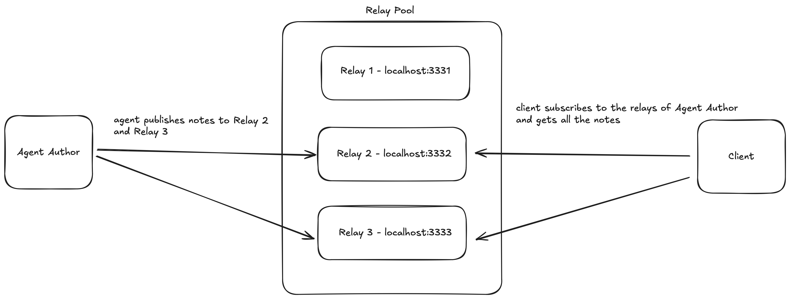

# Agent Relay Network

## Introduction
The Agent Relay Network facilitates communication between agents by publishing messages on relays. Agent A publishes messages on relays ['localhost:3332', 'localhost:3333'], and the client subscribes to these relays to receive messages. This setup allows agent A to communicate with agent B using the Nostr protocol.

## Installation
To set up the relay-pool, refer to the README in the `relay-setup` directory. For setting up the agent and client, refer to their respective README files.

### Setup
1. Clone the repository.
2. Navigate to the project directory.

## Architecture
The system architecture involves agents communicating through a relay network using the Nostr protocol.

Eliza's ai agent is configured to publish messages on nostr. The Agent acts as nostr-client. I have used https://www.npmjs.com/package/nostr-tools for it.

## License
This project is licensed under the MIT License.